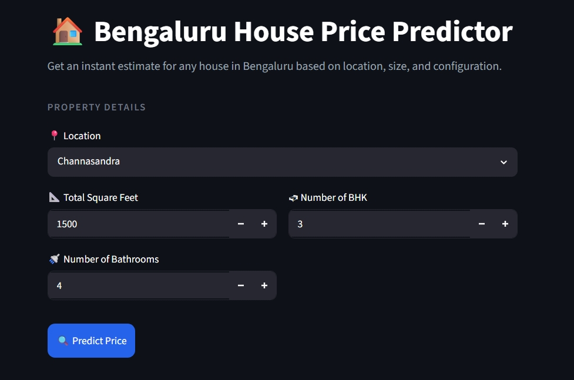

# 🏠 Bengaluru House Price Prediction

A machine learning project that predicts house prices in Bengaluru, India based on location, size, bathrooms, and BHK configuration.

## 📌 Project Overview
Using a dataset of 13,320 real estate listings, we clean the data, engineer features, train and compare 
multiple ML models, and deploy the best model as an interactive Streamlit web app. The final Linear 
Regression model achieves a 92.1% R2 score with an average error of just 12 lakhs — proving that 
location is by far the strongest predictor of house prices in Bengaluru.

## 📂 Project Structure
```
RealEstatePricePrediction/
│
├── app/
│   └── app.py                                 #Streamlit Web app
│
├── data/
│   ├── raw/
│   │   └── Bengaluru_House_Data.csv           #Original dataset
│   └── processed/                             #Cleaned and Featured datasets
│       ├── cleaned_data.csv
│       └── featured_data.csv
│
├── images/                                    #Charts and apps screenshots
│   ├── correlation_heatmap.png
│   ├── feature_importance.png
│   ├── input_app_demo.jpeg
│   ├── outlier_removal.png
│   └── result_app_demo.jpeg
│
├── models/                                    #Saved models and columns          
│   ├── best_model.pkl
│   └── columns.json
│
├── notebooks/                                 #Jupyter notebooks 
│   ├── 01_data_understanding.ipynb
│   ├── 02_data_cleaning.ipynb
│   ├── 03_feature_engineering.ipynb
│   ├── 04_model_building.ipynb
│   └── 05_model_evaluation.ipynb
│
├── reports/                                  #EDA report and model comparison   
│   ├── eda_report.pdf
│   ├── feature_importance.png
│   └── model_comparison.csv
│
├── src/                                       #Python Scripts
│   ├── data_understanding.py
│   ├── data_cleaning.py
│   ├── feature_engineering.py
│   ├── train.py
│   ├── evaluate.py
│   └── predict.py
│
├── README.md
├── requirements.txt
└── .gitignore
...
```

## 📊 Dataset
- Source: [Kaggle - Bengaluru House Price Data](https://www.kaggle.com/datasets/amitabhajoy/bengaluru-house-price-data)
- 13,320 rows, 9 columns
- Features: location, total_sqft, bath, balcony, size, area_type, availability, society, price

## 🔧 Steps Followed
1. **Data Understanding** — Explored shape, dtypes, missing values, distributions
2. **Data Cleaning** — Handled nulls, fixed size column, removed outliers
3. **Feature Engineering** — Encoded 1305 locations, one hot encoding
4. **Model Building** — Trained Linear Regression, Decision Tree, Lasso
5. **Model Evaluation** — MAE,MSE, RMSE, R2, actual vs predicted charts
6. **Deployment** — Streamlit web app with clean UI

## 🔄 Project Workflow

```text
Bengaluru House Data
          │
          ▼
   Data Understanding
          │
          ▼
     Data Cleaning
(Remove Nulls & Outliers)
          │
          ▼
  Feature Engineering
(Location Encoding,
BHK Extraction, etc.)
          │
          ▼
    Model Training
(LR, DT, Lasso)
          │
          ▼
   Cross Validation
 & Model Comparison
          │
          ▼
   Best Model Selection
 (Linear Regression)
          │
          ▼
   Model Serialization
(best_model.pkl)
          │
          ▼
   Streamlit Web App
          │
          ▼
 House Price Prediction
```

## 📈 Model Comparison

| Model | Train Score | Test Score | CV Mean | CV Std |
|---|---|---|---|---|
| Linear Regression | 0.865 | 0.921 | 0.902 | 0.036 |
| Decision Tree | 1.000 | 0.742 | 0.903 | 0.105 |
| Lasso | 0.845 | 0.908 | 0.890 | 0.041 |

## 🏆 Best Model
- **Linear Regression** — highest test score (0.921), lowest CV std (0.036), no overfitting

## 📉 Evaluation Metrics
| Metric | Value |
|---|---|
| R2 Score | 0.9216 |
| MAE | 12.03 Lakhs |
| RMSE | 18.88 Lakhs |

## 🚀 How to Run

**1. Clone the repository**
```bash
git clone https://github.com/PRAVEENKUMAR229/RealEstatePricePrediction.git
cd RealEstatePricePrediction
```

**2. Create virtual environment**
```bash
python -m venv venv
venv\Scripts\activate
```

**3. Install libraries**
```bash
pip install -r requirements.txt
```

**4. Run the app**
```bash
cd app
streamlit run app.py
```

## 🖼 App Demo
**Input Form**


**Prediction Result**


## 🌐 Live Demo

🔗 [https://your-streamlit-app-url.streamlit.app](https://realestatepriceprediction-5rw7n8nx36hluhqm6nqepb.streamlit.app/)

## 📦 Libraries Used
- Pandas, Numpy — Data Manipulation
- Matplotlib, Seaborn — Visualization
- Scikit-learn — Machine Learning
- Streamlit — Web app
- Pickle — Model saving
- fpdf2 — PDF report generation

## 👤 Author
MUDAVATH PRAVEEN KUMAR — [GitHub](https://github.com/PRAVEENKUMAR229)
